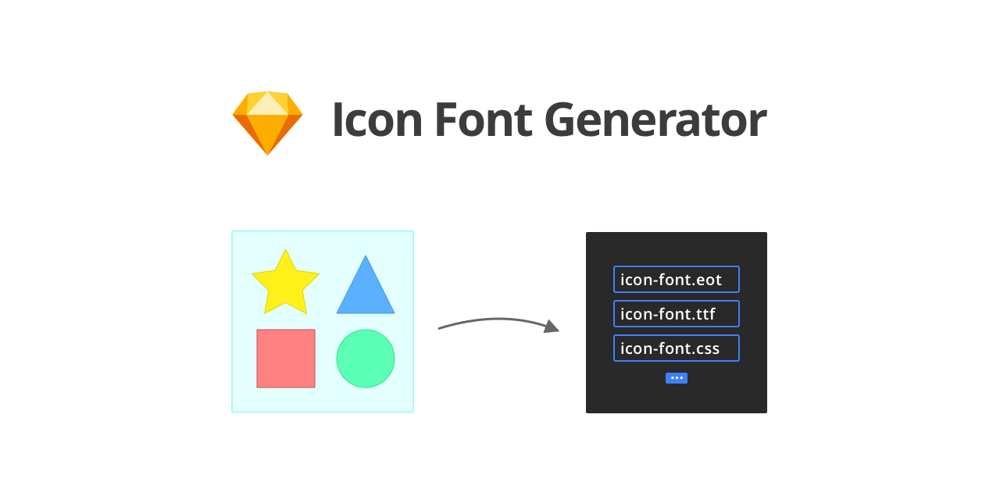

# Icon Font Exporter

Plugin that lets you export your designed icons to a web icon font. 
Psst… It’s developer friendly! You can define `.sketchconfig.json` files for each Sketch project 😉 …  

## Installation

- [Download](../../releases/latest/download/icon-font-exporter.sketchplugin.zip) the latest release of the plugin
- Un-zip
- Double-click on icon-font-exporter.sketchplugin

## Using `.sketchconfig.json` Configuration

You can create a `.sketchconfig.json` file in the same directory as your sketch mockup, if you want to store and adjust the behaviour of the plugin. Currently it is limited to some basic options.

Folder Structure:
- `YourDesigns.sketch`
- `.sketchconfig.json`

### Example `.sketchconfig.json` config:

```js
{
    "plugins": {
        "icon-font-exporter": { // selector/name of the plugin (it’s like a namespaces
            "pageName": "Icons", // name of the page in Sketch containing your icon artboards
            "output": "/Users/YOUR_USER/your_website.com/src/webfonts/" // Output folder (example)
        }
    }
}
```

## Development Guide

_This plugin was created using `skpm`. For a detailed explanation on how things work, checkout the [skpm Readme](https://github.com/skpm/skpm/blob/master/README.md)._

### Usage

Install the dependencies

```bash
npm install
```

Once the installation is done, you can run some commands inside the project folder:

```bash
npm run build
```

To watch for changes:

```bash
npm run watch
```

Additionally, if you wish to run the plugin every time it is built:

```bash
npm run start
```
